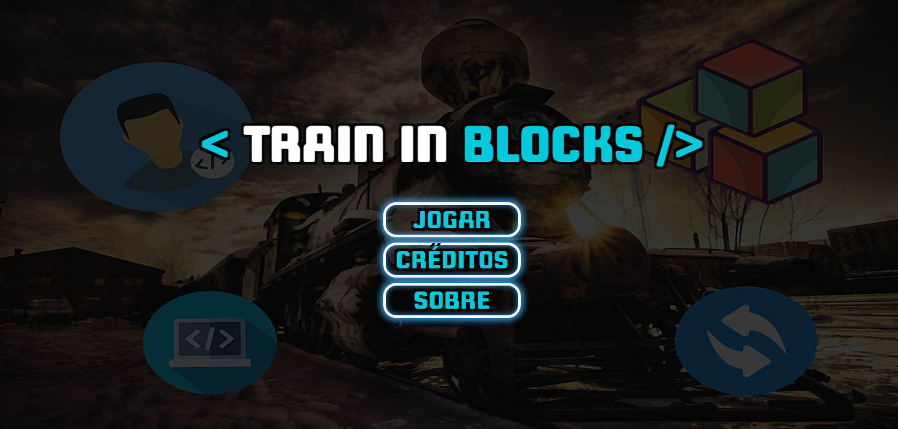
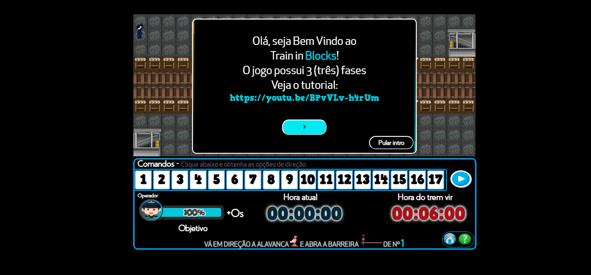
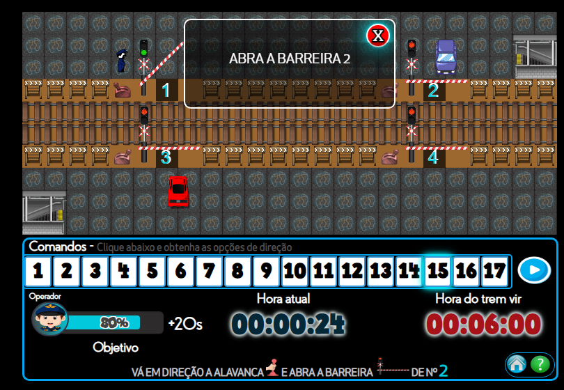

# Train in Blocks 🚂🕹️

Train in Blocks é um jogo desenvolvido pelo discente Paulo Alves da Silva, sob orientação do Prof. Dr. Richarlyson Alves D'Emery, durante a disciplina Interface Homem Máquina (IHM), do curso de Bacharelando em Sistemas de Informação da Unidade Acadêmica de Serra Talhada (UAST) da Universidade Federal Rural de Pernambuco (UFRPE). O jogo tem como objetivo exercitar de maneira lúdica conceitos de algoritmos apresentados em forma de blocos.

Acesse o jogo através do link: https://pauloalves98.github.io/br.edu.projetoihm.traininblocks/

## Autores 👨‍💻👨‍🏫

- Paulo Alves da Silva
- Prof. Dr. Richarlyson Alves D'Emery

## Ano 📅

2021

## Descrição do jogo 🎮

O jogo se passa em cenários constituídos por veículos, túneis, barreiras, obstáculos e um trem que atravessa a via em determinados períodos de tempo. O personagem principal é um operador que manipula alavancas contidas na ferrovia, podendo deixá-las abertas ou fechadas. O jogador deve ficar atento aos objetivos/desafios impostos pelo jogo para evitar danos ao personagem principal. Ao fim, o jogador terá seu desempenho avaliado.

### Capturas de tela 📸

#### Home Page

#### Tela de Carregamento

#### Tela Inicial

#### Jogando

## Tecnologias Utilizadas

-  JavaScript
-  HTML

## Universidade 🎓

Unidade Acadêmica de Serra Talhada/Universidade Federal Rural de Pernambuco (UAST-UFRPE)

